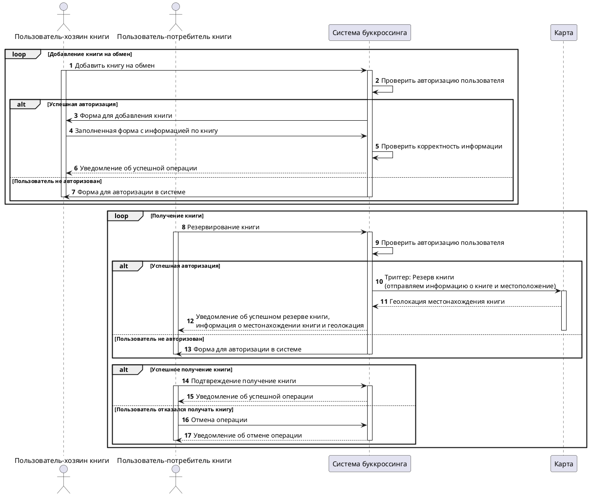

# qwerty

#### qwerty

```plantuml

@startuml
autonumber
actor "Пользователь-хозяин книги" as ph
actor "Пользователь-потребитель книги" as pp
participant "Система буккроссинга" as b
participant "Карта" as m
loop Добавление книги на обмен
ph -> b++: Добавить книгу на обмен
ph++
b -> b: Проверить авторизацию пользователя
alt Успешная авторизация
b -> ph: Форма для добавления книги
ph -> b: Заполненная форма с информацией по книгу
b -> b: Проверить корректность информации
b --> ph: Уведомление об успешной операции
else Пользователь не авторизован
b -> ph: Форма для авторизации в системе
b--
ph--
end
end
loop Получение книги 
pp -> b++: Резервирование книги
pp++
b -> b: Проверить авторизацию пользователя
alt Успешная авторизация
b -> m++: Триггер: Резерв книги\n(отправляем информацию о книге и местоположение)
m --> b: Геолокация местонахождения книги
b --> pp: Уведомление об успешном резерве книги,\nинформация о местонахождении книги и геолокация
m--
else Пользователь не авторизован
b -> pp: Форма для авторизации в системе
pp--
b--
end
alt Успешное получение книги
pp -> b++: Подтвреждение получение книги
pp++
b --> pp: Уведомление об успешной операции
else Пользователь отказался получать книгу
pp -> b: Отмена операции
b --> pp: Уведомление об отмене операции
b--
pp--
end
end
@enduml
```
